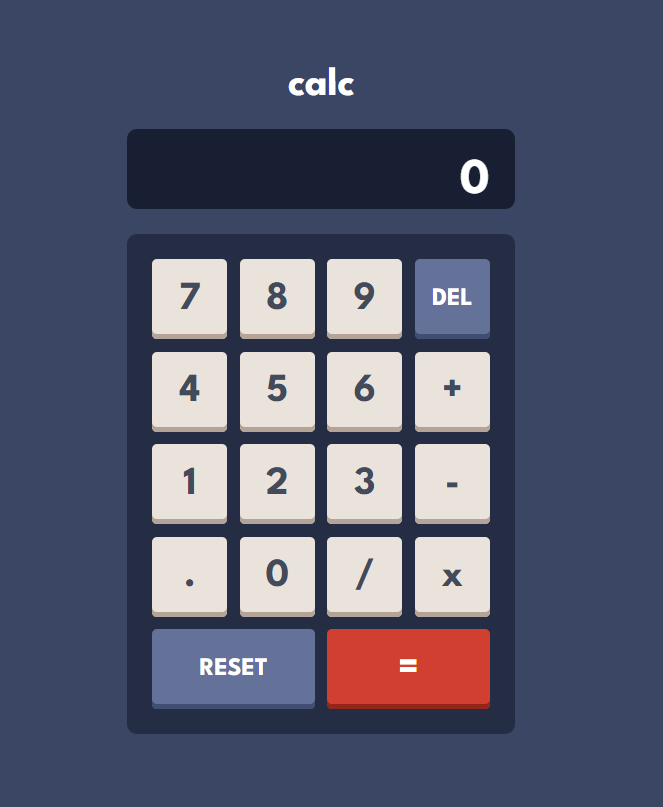

# Calculator

This is a simple calculator web application with responsive design. There are Addition, subtraction, multiplication, and division operations. Styling is from Figma.com

## Features

- Addition, subtraction, multiplication, and division operations.

- Responsive design for various screen sizes.

- Easy-to-use interface.

## Technologies Used

- React, Typescript, CSS

## Installation

To run the website locally, follow these steps:

1. Clone this repository.
2. Navigate to the project directory.
3. Install dependencies by running npm install.
4. Navigate to the client directory and start the frontend application using npm start.

## Contributing

I welcome contributions from the community to improve the website's functionality, user experience, and overall performance. If you'd like to contribute, please follow these steps:

1. Fork the repository.
2. Create your feature branch (git checkout -b feature/YourFeature).
3. Commit your changes (git commit -am 'Add some feature').
4. Push to the branch (git push origin feature/YourFeature).
5. Create a new Pull Request.

## Contact

If you have any questions, suggestions, or concerns, please don't hesitate to contact me at nana.grdzelishvili7@gmail.com. I appreciate your feedback!
